# SkipList and HashTable Implementation And Analysis
 BGU Data Structure course 4th assignment. Implementation and analysis of the Skip-List and HashMap Data Structures.

# Introduction
In this assignment, we discuss two main data structures seen in class, with some modifications: The Skip-List and Hash-Table. This assignment includes both practical and theoretical parts. The practical assignment is to be implemented using Java (version 17) using the included [skeleton files](Skeleton). 

This writeup is a cut and nicely organized version of my solution for the assignment, both can be found under [PDFs](PDFs).

# Skip List
A skip list (or skiplist) is a probabilistic data structure that allows O(LOG n) ⁡ average complexity for search as well as O(LOG n) average complexity for insertion within an ordered sequence of n elements.

This skip list is composed of nodes, each of these represents a single value in the data structure, and contains four fields:
- An array of pointers to the previous links, each position correlates to the previous link in the respective level of the skip list.
- An array of pointers to the next links, each position correlates to the next link in the respective level of the skip list.
- A height indicator.
- The value of the node.

Therefore, this implementation consists of several doubly-linked lists, and contains two sentinel nodes.

In the class [AbstractSkipList](Skeleton/AbstractSkipList.java) you are given implementations of the operations:

-  **insert(key)** - Inserts the key key into the DS - Θ(log n) expected.
-  **delete(node)** - Removes the node node from the DS - Θ(1) expected.
-  **search(key)** - Returns the node with key key from the DS if exists, or null otherwise - Θ(log n) expected.
-  **minimum()** - Returns the minimal non −∞ value in the DS - Θ(1) worst-case.
-  **maximum()** - Returns the maximal non +∞ value in the DS - Θ(1) worst-case.
-  **successor(node)** - Returns the successor of the key of the node node from the DS - Θ(1) worst-case.
-  **predecessor(node)** - Returns the predecessor of the key of the node node from the DS - Θ(1) worst-case.
-  **toString** - A basic toString implementation that prints all the values in each level.

### Task 2.1
- **find(key)** - Returns the node of the key key, or the node previous to the supposed location of such a node, if not in the data structure.
- **generateHeight()** - Returns a height generated by the result of a geometric process (defined below) with probability p ∈ (0, 1), where p is a parameter of the data-structure.

**Definition:** The result of a Geometric Process with probability p is the number of coin tosses until the first success ("head") (including), with probability p for success.

**Implement the two functions mentioned above in the class IndexableSkipList given to you.**
- **find(key)**
  
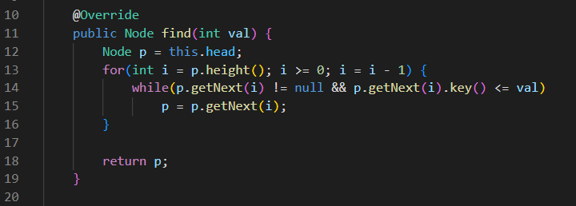

- **generateHeight()**

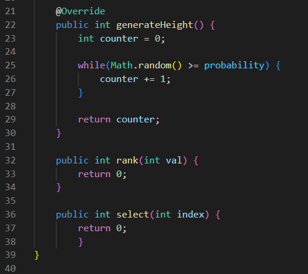

### Task 2.2
- **measureLevels(p, x)** - This function generates x random heights with probability p. It calculates the average number of levels (ˆℓ) described above and returns its value.

**Implement the function measureLevels in SkipListExperimentUtils, and for each p ∈ {0.33, 0.5, 0.75, 0.9} fill in the table**
- **measureLevels(p, x)**
  
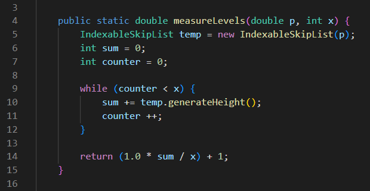

- **Measurement table**
  
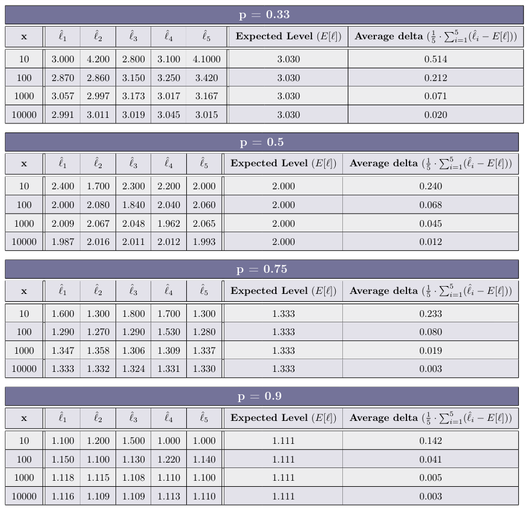

### Task 2.3
**How does the value of p affects the average number of levels (ˆℓi) generated by generateHeight?**

> The higher the probability for success the lower the average number of levels. (P is in inverse proportion to the average height)

### Task 2.4
**How does the value of x effects the average delta generated in each experiment? What can we deduce from that?**
> The larger the sample size (x) we are using the lower the delta we get. This is because over a lot of operations the random elements even out.

### Task 2.5
Now, we want to test the average time for each operation type on the data structure. In the class SkipListExperimentUtils, you are given the skeleton of the following functions:

-  **measureInsertions(p, size)** - This function returns a skip list of size size + 1 and the average time (in nano-seconds) for each insertion in the process as a Pair. The values inserted are the values in {0, 2, 4, . . . , 2 · size} in random order, and the data structure is with the parameter p.
- **measureSearch(DS, size)** - This function returns the average time (in nano-seconds) of a search in the data structure DS of an item from the values in {0, 1, 2, . . . , 2 · size} in random order.
- **measureDeletions(DS, size)** - This function returns the average time (in nano-seconds) for each deletionin the data structure DS of an item from the values in {0, 2, 4, . . . , 2 · size} in random order.
- **main(args)** - This is a standard main function, in which you should perform the experiments.

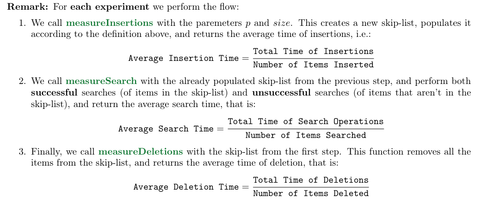

After each experiment, we get three measurements: Average Insertion Time; Average Search Time; Average Deletion Time.

Notice that since the order of operations is random, and due to the fact that time measurements on computers tend to be noisy (as explained in Practical Session 1), a single test may return unreliable results. To make our experimentation more reliable, we perform this flow 30 times, and calculate the average of each type of measurement.

That means that each table entry is of the form: 
> Average Measurement = (1 / 30) * sum of all measurements

**Implement the functions given in SkipListExperimentUtils, which includes the main function to perform the experiments described in the next question.**

The code is available [here](Implementation/SkipListExperimentUtils.java).

### Task 2.6
**Fill the table for each p ∈ {0.33, 0.5, 0.75, 0.9} with the average of 30 experiments for each value of x ∈ {1000, 2500, 5000, 10000, 15000, 20000, 50000}**

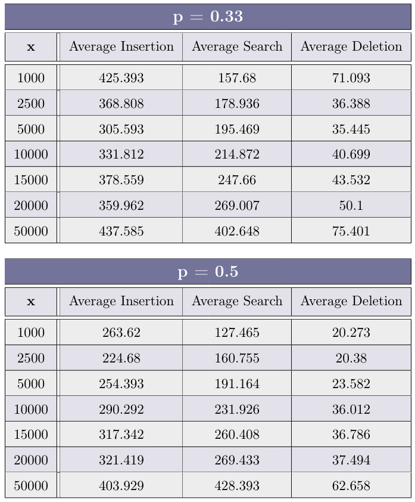

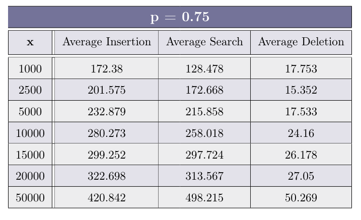

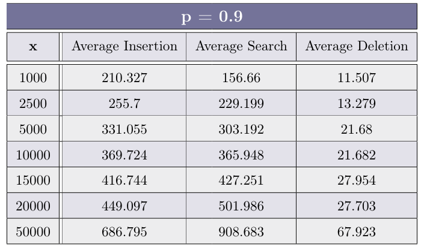

### Task 2.7
**After you have completed the experiments above, plot (using your favorite method, suchas Microsoft Excel, Google Sheets, Libre Office, etc.) a graph for each operation type (Insertion, Search andDeletion), depicting the average time of operation as a function of x. Each graph should include 4 plot lines -each representing a different value of p.**

- Insertion:

 

- Search

- Deletion
  

### Task 2.8
**Using the graph created above, how does the value of p effects each of the operations?**
> The average insertion time is the lowest when P is around the halfway point between0 and 1. that because when P is too high the generate-height function and thus the linking on each level takesmore time (because there are more levels). And also the find function used in the insert operation take longerdue to the list being higher (that’s because we also need to go down as well as to the right).And if the P value is too low there won’t be enough variety in different nodes’ heights, making the find functionmore and more similar to linear search - thus making it slower.

> Search: The lower the P value, the lower the average search time, up to a certain threshold, due to the samereason as in Insertion.

> Delete: The lower the P, the higher the average deletion time.

### Task 2.9
In questions (2.9) (2.10) (2.11), we will revise the calculation of the expected height/size/Insertion/Search cost, and extend it to any value 0 < p < 1. In your proofs you will show all the mathematical developments done in order to prove your result.

**What is the expected number of nodes in a conceptual Skip-List containing n elements, not including the Sentinels, as a function of p? Prove your answer.**

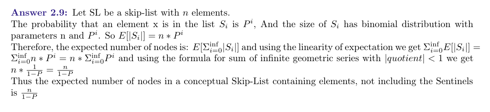

### Task 2.10
**What is the expected height of a Skip-List as a function of p? Prove your answer.**

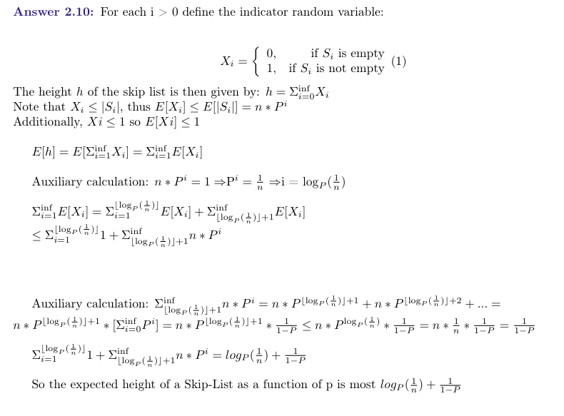

### Task 2.11
**What is the expected time complexity of Insertion/Search as a function of p? Prove your answer. How does it compare with the empirical results in Question (2.6)?**

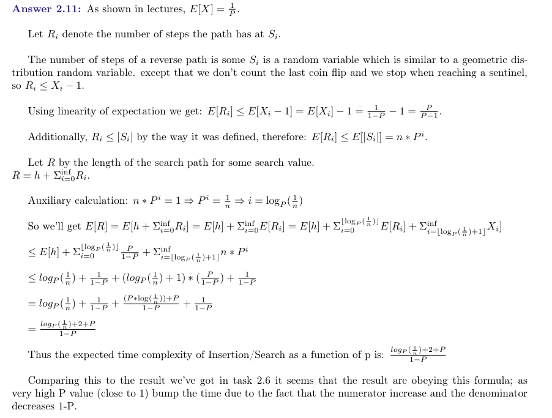

### Task 2.12
**Implement both Select(i) and Rank(val) in the class IndexableSkipList.To implement the functions mentioned previously, you may change some implementation details in the classAbstractSkipList. These changes should be minimal. You are allowed to increase the time complexity of theoriginal operations (listed at 2.1.1), to at most Θ(log n) Expected.**

The changes must be documented in the theoretical section as follows:

- What additional space (number of memory cells) has been added? What is the purpose of this memory addition? What is the space complexity added to the data structure?
- What operations differ from the original implementation? For each of these changes, you must include a Pseudo-Code of the new algorithm highlighting the changes over the original (see an example for highlighting in the Pseudo-Code example in the beginning of the pdf skeleton file). If the time complexity has changed, explain the new time complexity,and why it has changed compared to the original operation.
- What new methods were added, a short explanation of each method and its algorithm, a Pseudo-Code of the operation, and a time complexity analysis of the method.

**Hint:** Think about the process we have seen on AVL-Trees. Skip-Lists’ operations are similar (but not identical).

I did not answer this one due to a lack of time, I might get back to this question for fun in the future.

# Hash Table ADT

## Hashing
In this section, we will deep-dive into one of the more popular data structures, to better understand the differentimplementations seen in class, and get familiar with the costs associated with some of the operations of this datastructure. To do so, we will implement several different hashing families, and two distinct collision-resolvingschemes.

**Definition:** A Hash Table for the universe U is a pair (A, h) of an array A of size m, and a mapping h : U → [m] called **Hash Function**, that is, a function that for each item in the universe, map it into a specific index of A.

In order to indicate how occupied the hash table is, we also defined the following term:

**Definition:** The Load Factor of a table of size m with n items, including deleted signs, is:
> α = n / m

As mentioned above, since we assume that |U| ≫ m (much greater than), according to the pigeonholeprinciple any mapping h : U → [m] isn’t one-to-one, therefore, we anticipate that some items will collide inthe same address. In order to cope with such collisions, we must define the behavior of the data structure insuch events.

**Definition:** In Closed Addressing collision-resolving scheme, each item resides in the address given by the hashing function. Each address may contain several items and must keep track of all those using a different data structure.

The most common Closed Addressing scheme is putting all items mapped to an address in a singly linked-list,
which is known as Chaining (Luhn 1953, Dumey 1956).

**Definition:** In Open Addressing collision resolving scheme, each item may be remapped from the address given by the hashing function. The scheme must define where to put items that suppose to reside in occupied addresses. In this scheme, since all items reside directly in the array A, we must enforce that α < 1 and is a constant. 

The most commonly used open addressing scheme is the Linear Probing (Amdahl, McGraw and
Samuel 1954, Knuth 1963).

**Reminder:** In the Linear-Probing scheme, we try to put the item x in the address h(x). If it is occupied, we continue to the next address (mod m) and continue to do so as long as the addresses are occupied. On deletion, perform one of the following variants:
1. We don’t remove the items from the table. Instead, we use a special flag to denote whether an item is
valid or deleted.

2. On deletion, we perform rehashing to the entire block

**Remark:** In this assignment, we exclusively refer to the variant of Linear Probing that uses deleted signs
(Variant 1).

## Hash Functions
In addition to the collision-resolution scheme, we must also choose a hash function, hopefully getting a gooddistribution of the items in the different addresses of the table. However, finding such a function is a difficulttask; In most cases, there is no one good function, and we instead pick at random a function from a family offunctions that promise to usually provide a good distribution of the items.

Definition: A family of functions H ⊆ U → [m] is called Universal if for each x, y ∈ U the probability of picking at random a function h ∈ H that map both into the same address is at most (1 / m) . Formally:

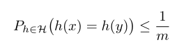

The research on such families is vast, and different function families have different qualities. However, findinga truly universal family is quite difficult, and many of the well-known Universal Hashing Families are hard tocompute on the standard computers in use.

###  Carter-Wegman (1979)
The first family of functions we are going to use in this task is the Carter-Wegman Modular hash family, seen
in class.

 **The Crater-Wegman (1979)** universal hashing family is defined for integer items. In this task, we limit the values to all items that fit the int data-type of Java, meaning U = int. In this family, we randomly choose two integers a, b and a prime long integer such that:
 
a ∈ {1, 2, 3, ..., Integer.MAX_VALUE − 1}

b ∈ {0, 1, 2, ..., Integer.MAX_VALUE − 1}

p ∈ {Integer.MAX_VALUE + 1, . . . , Long.MAX_VALUE}

Given those, the hash function selected is:
H a,b (x) = ((a · x + b) mod p) mod m 

**Remark:**  Notice that in order to calculate the value a · x + b, we save the outcome in a long variable. Since we enforce m < 2^31 − 1, the result of the second mod ensures us the end result can be safely stored in an int variable.

**Remark:**   In Java, the operator % isn’t a one-to-one replacement of mod, and may return a negative number, but must comply with: (−m) < x % m < m

Therefore, you are given a function mod in HashingUtils in order to correct the result for negative numbers

###  Dietzfelbinger et al. (1997)

**Definition:** An Almost-Universal family of functions is a family that promises the same as a Universal family, with a higher probability for collisions; Instead of a probability of (1 / m), that probability of identical mapping of two items is (2 / m) . That is: for each x, y ∈ U

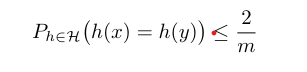

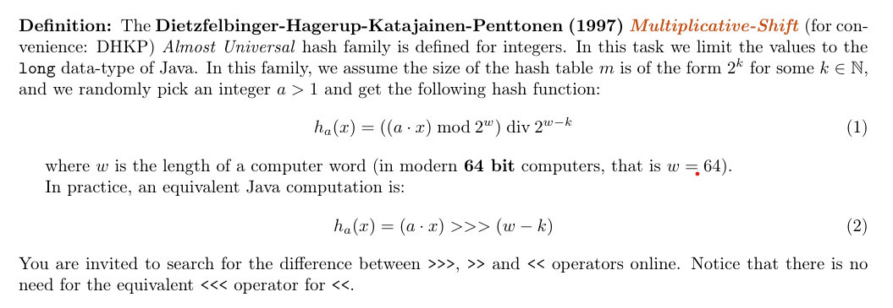

### Task 3.1
**Explain why the computation in equation (1) is truly equal to the one in equation(2) in a 64-bit machine.**

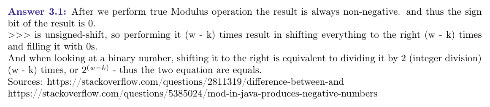

### Task 3.2
In this section we will discuss hashing objects that are more complex than integers. In our task, we will represent such objects using strings. For simplicity, our strings must hold only ASCII characters. In order to do so, we transform the string into an integer; We choose a random prime, q, such that:

Integer.MAX_VALUE/2 < q ≤ Integer.MAX_VALUE

and choose 2 ≤ c < q.

Now we look at each string as a sequence of characters (x1, x2, x3, . . . , xk), and transform it using the following mapping:

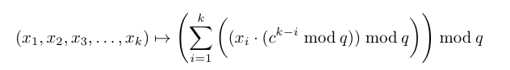

We feed the result of this mapping into the simpler Carter-Wegman hash for [q] → [m].

**Suggest a way to use the Carter-Wegman hashing for strings in order to hash any object type in Java**
> We can look at the object’s binary representation and collect it into chunks of 8 bits (fill the reminder of the last one with 0s if needed). After that look at each chunk as a single ASCII character and use the Carter-Wegman hashing for strings on the resulted string.

## Hash Implementations
In this task, you are given two interfaces. The interface **HashFactory** represents a family of hash functionsand is capable of returning a new random hash function when given a table size m. The second is the interface **HashFunctor** which represents a hash function, and is implemented as a nested-class inside each HashFactory implementation.

The **HashFactory** interface contains only one function:
- **pickHash(k)** - Given some k ∈ N, returns a randomly chosen hash function from the family of hash functions, where m = 2^k

The **HashFunctor** interface also contains a single function:
- **hash(key)** - Given a valid key key, calculates its mapping into [m]. m, the size of the matching hash table, is a field of the class (and defined at the constructor of this Functor).

**Remark:** For your convenience, you are supplied with a utility class named HashingUtils that contains the following public methods:
- runMillerRabinTest(long suspect, int rounds) - A function that runs the Miller-Rabin Primality Test for the number suspect for rounds times.
- genLong(long lower, long higher) - A function that uniformly generates numbers between lower (inclusive) and higher (exclusive).
- genUniqueIntegers(num) - Returns an array of size num filled with uniquely generated items of type Integer.
- genUniqueLongs(num) - Returns an array of size num filled with uniquely generated items of type Long.
- genUniqueStrings(num, stringMinLength, stringMaxLength) - Returns a list of num uniquely generated items of type String of length stringM inLength ≤ length ≤ stringM axLength.
- fastModularPower(long x, long y, long *mod*) - A function that calculates x^y mod *mod*.

You may find these functions useful in your implementations.

### Task 3.3
**Implement the Carter-Wegman hash family for int → [m] in the class ModularHash.**
> The code is in [Implementation](Implementation)

### Task 3.4
**Implement the Dietzfelbinger et al. hash family for long → [2^k] using the shortened version defined in equation (2) in the class MultiplicativeShiftingHash.**
> The code is in [here](Implementation/MultiplicativeShiftingHash.java)

### Task 3.5
**Implement the Carter-Wegman hash for strings assuming the strings are ASCII in the class StringHash**
> The code is in [here](Implementation/StringHash.java)

## Hash Tables

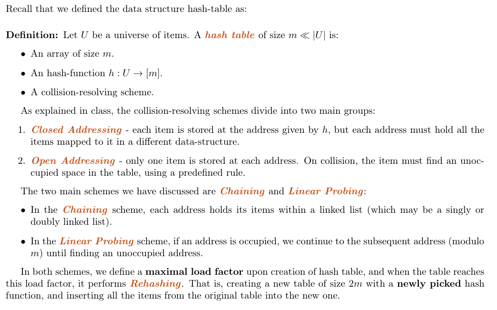

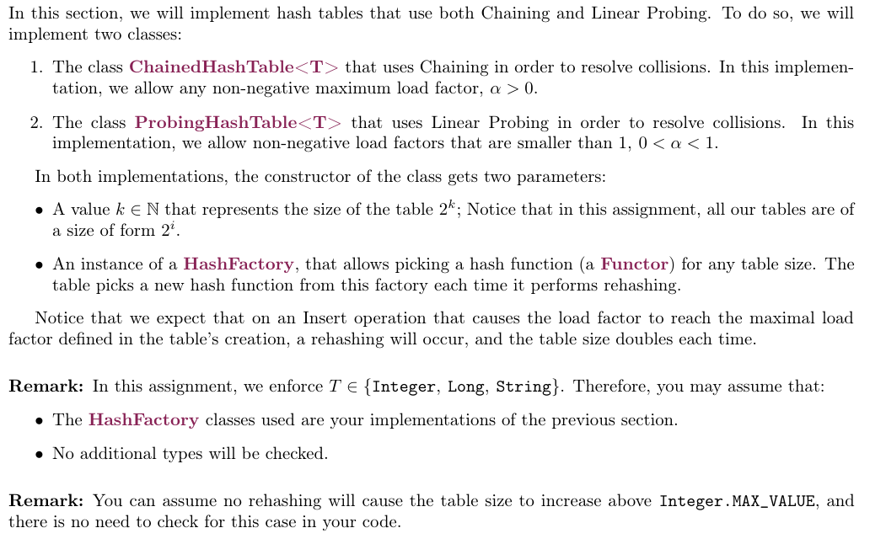

### Task 3.6
**Implement the Chaining-based hash table in the class ChainedHashTable<K, V>**
> The code is available [here](Implementation/ChainedHashTable.java).

### Task 3.7
**Implement the Linear Probing-based hash table in the class ProbingHashTable<K,V>.**
> The code is available [here](Implementation/ProbingHashTable.java).

### Task 3.8

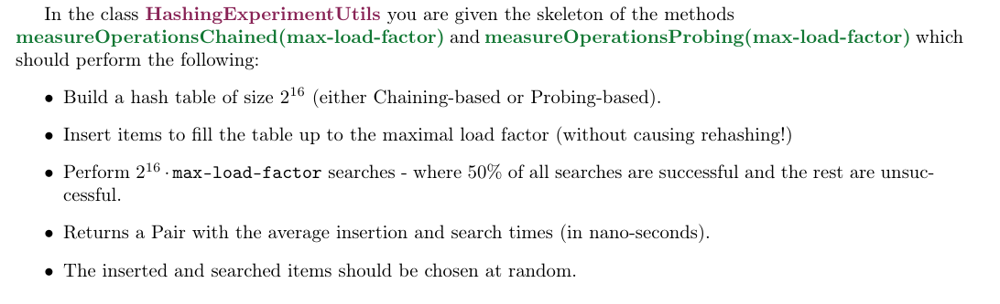

**Run the measurements on ProbingHashTable for 30 times, and complete the average Insertion and Search time (in nano-seconds) for the max load factors α ∈ {1/2, 3/4, 7/8, 15/16} in the table:**

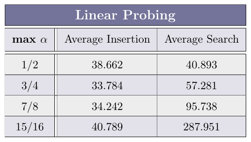

### Task 3.9
**What can we deduce regarding the relation of the load-factor to the average operation time in Linear-Probing based hash tables?**
> The higher the load factor, the slower each operation takes, and it approach O(n) as the loadfactor approaches 1. That’s because in each traversal of the table we need to look for an empty cell for longer time (because the table is in higher capacity).

### Task 3.10
**Run the measurements on ChainingHashTable for 30 times, and complete the average Insertion and Search time (in nano-seconds) for the max load factors α ∈ {1/2, 3/4, 1, 3/2, 2} in the table:**

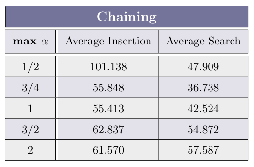

### Task 3.11
**What can we deduce regarding the relation of the load-factor to the average operation time in Chaining-based hash tables?**

> The higher the load factor the higher the search on averge, that’s because in addition to going into the right cell we also need to perform linear search in the linked list to find the item (if exist). But the insertion stays relatively contant because we inserting element to the head of the list - making its length irrelevant.

### Task 3.12
In HashingUtils you are given functions that return a list of num unique random items of type Integer,Long and String respectively. Using these functions, we wish to test the cost of the hashing functions inour implementations of hash tables. In order to do so, we will perform the same experiment executed inmeasureOperationChained(max-load-factor) for max-load-factor = 1. We want to run the experiment 10times using a table that accepts Long keys, and 10 times for a table accepting String keys.To do so, you are requested to implement the following functions in HashingExperimentUtils and runthe experiment:

- **measureLongOperations()** - Measures the cost of a table using Dietzfelbinger et al. for Long items.
- **measureStringOperations()** - Measures the cost of a table using Carter-Wegman for Strings, with strings of length 10 to 20.

**What are the results of the experiment described above? What can we deduce from these results?**

The results are:

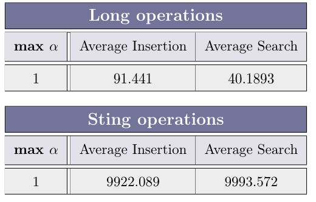

We can deduce that hashing strings is a lot more expensive that hashing numbers using the Dietzfelbinger et al hashing algorithm.

# Theoretical Questions
The ADT **Dictionary** includes three operations: **Insert(x), Search(key) and Delete(x)**. It can be implemented using Hash Tables with Chaining, with time complexity of Θ(1) worst case, Θ(1) expected, and Θ(1) expected, respectively. In this section, we will look at the implementation of additional operations using Chaining-based Hash Tables.

In each of the following questions, you must describe an algorithm, write a Pseudo-Code, and analyze its time complexity.

**Remark:** Notice that you may not change the time complexity of the original Insert/Search/Delete operations.

### Task 3.13
**Describe the operation Successor(val), where val exists in the hash table.**

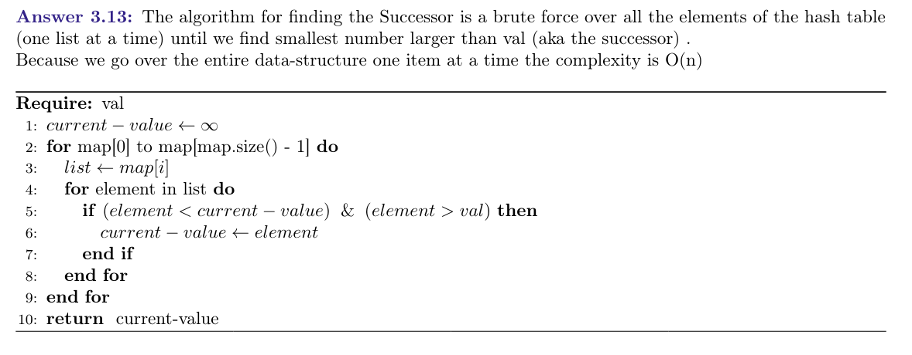

### Task 3.14
**Describe the operation Minimum()**

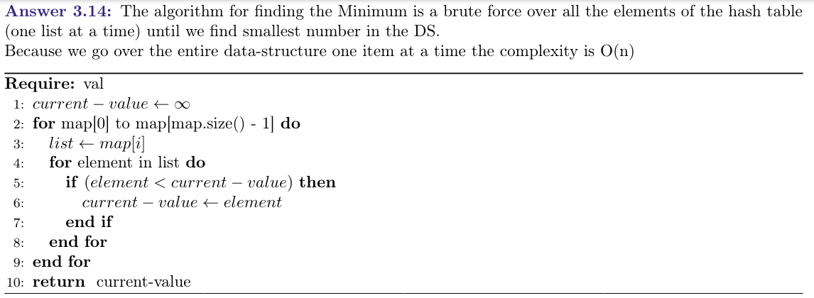

### Task 3.15
**Describe the operation Rank(val), where val might not appear in the hash table.**

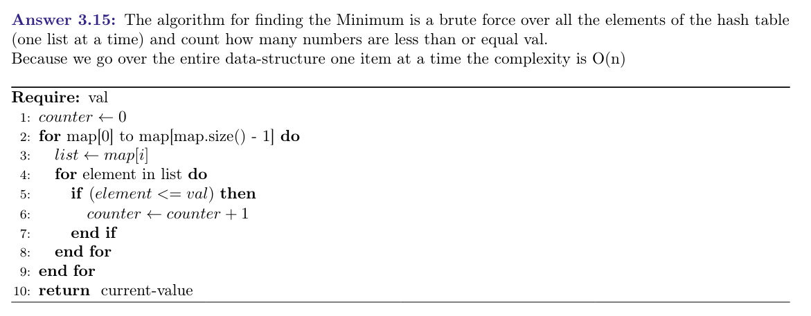

### Task 3.16
**Describe the operation Select(i), where 1 ≤ i ≤ n.**

> The algorithm for finding the ith number in the hash table is finding the maximum of the DS in O(n) and using the radix sort algorithm from class and going to the ith element Because we go over the entire data-structure to find the maximum in O(n) and then perform radix sort in O(n) the overall time complexity is O(n)

# Designing a data structure according to given specifications
In this section, we will design a new data structure according to a specified ADT and its time complexity requirements. This DS will contain int values, thus, val is always of type int. The requirements of the ADT are

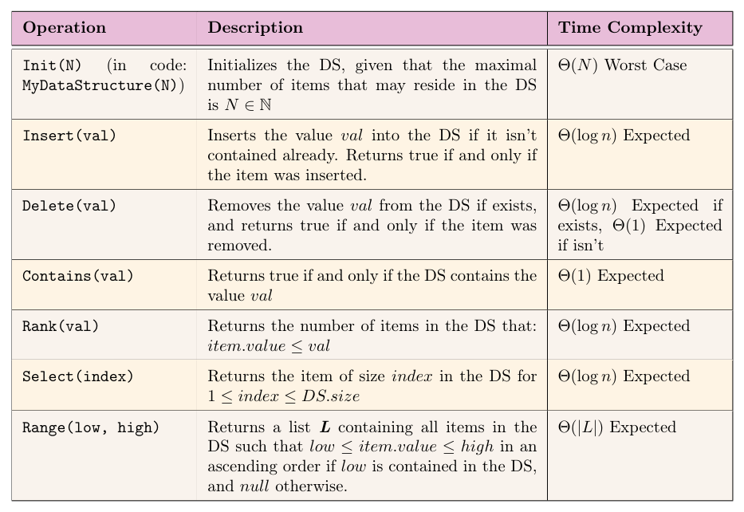

### Task 4.1
Implement a data structure that supports the requirements mentioned previously in the class **MyDataStructur**e. Provide a short (5 lines each) explanation of each of the implementations, and explain the time complexity of each of the operations.

I did not answer this one due to a lack of time, I might get back to this question for fun in the future.
